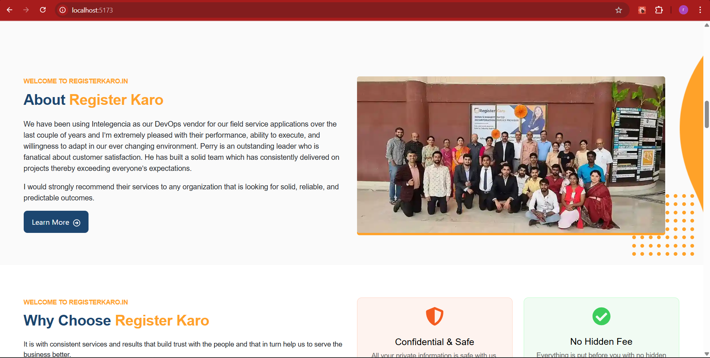

# React + Vite

This template provides a minimal setup to get React working in Vite with HMR and some ESLint rules.

Currently, two official plugins are available:

- [@vitejs/plugin-react](https://github.com/vitejs/vite-plugin-react/blob/main/packages/plugin-react/README.md) uses [Babel](https://babeljs.io/) for Fast Refresh
- [@vitejs/plugin-react-swc](https://github.com/vitejs/vite-plugin-react-swc) uses [SWC](https://swc.rs/) for Fast Refresh

Figma Design Link - https://www.figma.com/design/BWtutOCqSUinQiqoSCDQ0c/Register-Karo-Home-Page-(Copy)?node-id=1-21315&t=9C0PMt6b4vvupYpo-0

<h1> Desktop Screenshot </h1>

<h1> Mobile Screentshot </h1>

